# Upstream Copilot CI/CD Design

**Date:** 2026-07-15  
**Target repository:** `hundan2015/aiosteampy` (public)  
**Observed upstream:** `DoctorMcKay/node-steamcommunity`, default branch `master`

## Goal

Run a daily GitHub Actions workflow that detects new upstream commits, classifies each change with GitHub Models, ignores maintenance-only changes, groups meaningful changes by functional area, and assigns a structured GitHub issue to Copilot cloud agent. Copilot must implement the applicable change in aiosteampy and open a pull request for human review.

The system uses only GitHub-hosted capabilities available to a Copilot Student subscriber: GitHub Actions, GitHub REST/GraphQL APIs, GitHub Models, GitHub Issues, and Copilot cloud agent. It does not call an external model or automation service.

## Scope

A change is meaningful only when it is one of:

- `STEAM_BEHAVIOR`: Steam changed a website, API, protocol, endpoint, header requirement, request parameter, response field, or value format.
- `PORTABLE_BUG`: node-steamcommunity fixed an algorithmic or control-flow defect that has an equivalent failure mode in aiosteampy.

The workflow must not dispatch Copilot for:

- dependency or security-only updates;
- version bumps, lockfile-only changes, documentation, formatting, or CI maintenance;
- upstream features that aiosteampy intentionally does not implement;
- JavaScript/runtime-specific bugs to which the Python architecture is immune;
- uncertain classifications lacking concrete patch evidence or a plausible local target.

The system creates pull requests but never approves or merges them.

## Selected Architecture

```mermaid
flowchart LR
    S[Daily schedule or manual run] --> H[Read upstream cursor]
    H --> C[Fetch commits and patches]
    C --> F[Deterministic maintenance filter]
    F --> M[GitHub Models classification]
    M --> G[Group meaningful commits by functional area]
    G --> I[Create idempotent candidate issue]
    I --> A[GraphQL assign issue to Copilot]
    A --> P[Copilot creates pull request]
    P --> R[Human review and CI approval]
```



Direct Agent Tasks API dispatch is not used. As of 2026-07-15, the documented direct `POST /agents/repos/{owner}/{repo}/tasks` endpoint is limited to Copilot Business or Enterprise. Copilot Student includes cloud agent, so the compatible dispatch mechanism is issue assignment through the Issues GraphQL API.

Copilot Automations are also not used because they currently require a private or internal repository, while aiosteampy is public.

## Repository Artifacts

Implementation adds these artifacts:

- `.github/workflows/upstream-drift.yml`: scheduling, permissions, concurrency, checkout, execution, and state persistence.
- `.github/scripts/upstream_drift.py`: upstream retrieval, filtering, model calls, schema validation, grouping, issue creation, Copilot assignment, and summary generation.
- `.github/prompts/upstream-classifier.prompt.yml`: versioned classifier instructions and output contract.
- `.github/upstream-drift-state.json`: last fully processed upstream SHA and dispatched functional-area keys.
- `.github/copilot-instructions.md`: repository layout, supported scope, test commands, and constraints for Copilot-created changes.
- `tests/test_upstream_drift.py`: deterministic unit tests for filtering, classification validation, grouping, cursor behavior, and idempotency.

Complex processing belongs in Python, not shell embedded in workflow YAML.

## Workflow Trigger and Permissions

The workflow runs once daily at a non-peak minute, for example `17 3 * * *`, and supports `workflow_dispatch`. Scheduled execution is best-effort and may be delayed by GitHub; correctness therefore depends on a commit cursor rather than a 24-hour time window.

Concurrency uses one stable group with `cancel-in-progress: false`. A second run waits rather than cancelling a run that may already have created an issue.

Minimum workflow permissions:

```yaml
permissions:
  contents: write
  issues: write
  models: read
```

`contents: write` is limited to committing the updated state file. Pull-request permission is not required for the monitor because Copilot creates its own branch and pull request.

## Authentication

Two tokens have separate purposes:

1. `GITHUB_TOKEN`: fetches public upstream metadata, calls GitHub Models through `models: read`, creates issues, and commits state.
2. `COPILOT_ASSIGN_TOKEN`: a fine-grained personal access token stored as an Actions secret. It is used only for the GraphQL operation that assigns an issue to `copilot-swe-agent` with agent-assignment parameters.

The fine-grained token is restricted to `hundan2015/aiosteampy`. Based on the current GitHub API documentation, assigning Copilot requires read access to metadata and read/write access to Actions, Contents, Issues, and Pull requests. The implementation documents these permissions beside the secret name.

No token value, authorization header, or raw authenticated response is written to logs, issues, artifacts, or summaries.

## Cursor and State Semantics

The state records:

```json
{
  "upstream": "DoctorMcKay/node-steamcommunity",
  "branch": "master",
  "last_processed_sha": "<full SHA>",
  "dispatched": {
    "<functional-area>:<newest-SHA>": {
      "issue": 123,
      "commits": ["<full SHA>"]
    }
  }
}
```

On first deployment, an empty cursor initializes to the current upstream HEAD without processing historical commits. A manual `from_sha` input enables intentional backfill.

For later runs:

1. Resolve current upstream HEAD.
2. Walk the complete first-parent-independent commit comparison from the stored cursor to HEAD and process commits oldest-first.
3. Refuse to advance if the cursor is no longer an ancestor of HEAD; report upstream history rewrite for manual intervention.
4. Persist the new cursor only after every discovered commit has a final classification and every meaningful functional-area issue has been created and successfully assigned.
5. Commit the state with a bot-authored message. A workflow failure leaves the previous cursor intact so the next run retries safely.

The workflow is idempotent. Before creating an issue, it checks both state and open/closed issues for the deterministic marker:

```text
upstream-drift:<functional-area>:<newest-full-SHA>
```

## Upstream Harvesting

For every new commit, the script obtains:

- full and short SHA;
- author date and first-line message;
- parent SHAs;
- changed file paths;
- unified patch;
- commit and patch URLs.

Merge commits are not automatically meaningful. If a merge contains no unique payload already represented by its parents, it is recorded but not independently classified or dispatched.

The script uses authenticated GitHub API requests where possible. Rate limits, network errors, truncated diffs, or malformed responses are hard failures that preserve the cursor.

## Deterministic Pre-filter

Before spending a model request, the script classifies obvious maintenance changes using file paths and diff content. Examples include:

- package version-only edits;
- lockfile-only dependency resolution;
- documentation-only changes;
- CI/configuration-only changes;
- formatting-only changes with no token-level logic delta;
- pure merge commits whose payload is already covered.

A mixed commit touching implementation code is never discarded solely because it also changes a lockfile or documentation.

Each pre-filter decision is included in the workflow summary.

## GitHub Models Classification

Each substantive commit is classified separately. The request contains:

- commit metadata and patch;
- strict category definitions;
- the known upstream-to-local module map;
- aiosteampy's explicitly unsupported surfaces;
- instructions to distinguish a Steam contract change from a library-internal bug;
- instructions to determine whether the defect is portable to Python;
- a JSON output schema.

Expected result:

```json
{
  "classification": "STEAM_BEHAVIOR | PORTABLE_BUG | UPSTREAM_ONLY | MAINTENANCE | UNCERTAIN",
  "functional_area": "mobileconf-ua",
  "meaningful": true,
  "confidence": 0.94,
  "root_cause": "Steam now rejects mobileconf requests without a mobile user agent.",
  "evidence": ["+ 'user-agent': 'okhttp/4.9.2'"],
  "local_targets": ["aiosteampy/mixins/confirmation.py"],
  "suggested_tests": ["confirmation requests carry the required user-agent"]
}
```

The script validates types, enum values, evidence presence, local target plausibility, and a confidence range of 0 to 1. It dispatches only `STEAM_BEHAVIOR` or `PORTABLE_BUG` records with `meaningful: true`, confidence at least `0.80`, non-empty patch evidence, and at least one plausible local target.

An invalid model response is retried once. A second invalid response fails the workflow without advancing the cursor. `UNCERTAIN` is a completed non-dispatch classification and is highlighted in the workflow summary for manual review.

If a patch exceeds the model input budget, the script divides it by changed file and hunk, classifies the pieces, then makes one bounded consolidation request. It never silently truncates the end of a patch.

## Functional-area Grouping

Classification remains per commit for traceability. Meaningful records from the same run are then grouped by normalized `functional_area`.

A group is ordered oldest-first and describes the final upstream state, not only each intermediate patch. This prevents creating one pull request for an initial adaptation and another for a follow-up correction to that adaptation. The known date-parser sequence `0f7fc98` followed by `6e20fbe` is the reference case: both belong to one `econ-item-dates` issue.

One group creates at most one issue and one Copilot pull request.
### Commit Provenance

Every upstream record retains its full 40-character SHA, short SHA, canonical commit URL, message, and patch throughout classification, functional-area grouping, issue generation, and Copilot assignment. The classifier response includes the full SHA in every per-commit record; no downstream step may replace it with an unqualified short SHA.

Every substantive aiosteampy commit created to implement an upstream-drift issue MUST end its commit body with one line per source commit, ordered oldest-first:

```text
Upstream: DoctorMcKay/node-steamcommunity@<40-character-SHA>
```

For example, the final local implementation of the date-parser functional area contains:

```text
Upstream: DoctorMcKay/node-steamcommunity@0f7fc98ab554068bfd733473c43220b27681b609
Upstream: DoctorMcKay/node-steamcommunity@6e20fbe2999fa402247d9d06423f43e1f231ced5
```

This matches aiosteampy's existing `d713a9b` commit convention. PR descriptions and issue bodies supplement, but MUST NOT replace, the local Git commit-body annotations. Test-only, formatting-only, or follow-up review commits need not repeat the annotations unless they implement additional upstream behavior.

The candidate issue lists the exact required annotation block and instructs Copilot to preserve it verbatim in the final substantive implementation commit. The human reviewer verifies it before merging.


## Candidate Issue Contract

The issue title follows:

```text
[upstream drift] <functional area>: adapt <one-line final behavior>
```

The body contains:

- the idempotency marker;
- all upstream commit SHAs and URLs;
- per-commit classifications, confidence, root cause, and evidence;
- the functional timeline and final upstream behavior;
- likely aiosteampy files;
- a concrete failure scenario;
- required behavioral tests;
- explicit implementation constraints.
- the exact ordered `Upstream:` commit-body annotation block required for the local implementation commit;

The constraints tell Copilot to:

1. verify that aiosteampy is actually affected before editing;
2. close the issue without code if source inspection proves structural immunity or out-of-scope behavior;
3. fix the source cause, not suppress an exception or warning;
4. add or update tests that fail on the prior behavior;
5. run the relevant pytest selection;
6. avoid unrelated refactors and dependency updates;
7. open one pull request linked to the issue;
8. never merge the pull request.
9. include each source line from the issue's ordered `Upstream:` annotation block verbatim in the body of every substantive implementation commit; and
10. never claim upstream provenance in a commit that does not implement behavior from that source.

Issues receive labels `upstream-drift`, `copilot`, and `needs-human-review`. Missing labels are created idempotently by the workflow.

## Copilot Assignment

After creating the issue, the script:

1. queries `suggestedActors(capabilities: [CAN_BE_ASSIGNED])` and locates `copilot-swe-agent`;
2. obtains the repository and issue GraphQL IDs;
3. invokes an issue assignment mutation with `agentAssignment` targeting the same repository and default branch;
4. leaves model selection empty so Copilot Student uses its required automatic model selection;
5. verifies that the issue assignee now includes `copilot-swe-agent`.

If Copilot is unavailable, the token lacks permission, assignment fails, or no agent actor is returned, the issue remains as an audit record but the workflow fails and does not advance the cursor. The next run finds the existing marker and retries assignment instead of creating a duplicate issue.

Copilot cloud agent raises the pull request and requests human review. The workflow does not promise that the PR is a draft because issue assignment documentation guarantees a pull request but does not guarantee draft status for this entry point. Human review and branch protection are the safety boundary.

## Pull Request and CI Safety

No pull request is automatically approved or merged. Branch protection should require relevant tests and at least one human approval.

GitHub currently does not run Actions automatically for Copilot-pushed pull-request changes by default. The repository owner must either:

- inspect the diff and click **Approve and run workflows**, which is the safer default; or
- explicitly configure Copilot agent settings to permit automatic workflow execution.

The initial design keeps manual CI approval because Copilot may edit workflow files and Actions can access secrets. The monitor's `COPILOT_ASSIGN_TOKEN` is never exposed to pull-request workflows.

## Error Handling and Observability

The workflow summary lists:

- old and new upstream HEAD;
- every discovered commit;
- deterministic filter decisions;
- model category, confidence, and evidence;
- functional-area groups;
- created or reused issue links;
- Copilot assignment result;
- cursor update result.

Failure rules:

- upstream/API/model failure: fail, preserve cursor;
- invalid or incomplete classification: retry once, then fail;
- uncertain but valid classification: record, do not dispatch, permit cursor advance;
- issue creation succeeds but assignment fails: fail, preserve cursor, reuse issue on retry;
- state commit conflicts with another run: fail; concurrency should make this exceptional;
- upstream history rewrite: fail with explicit manual recovery instructions.

## Testing Strategy

Unit tests mock HTTP boundaries and verify observable behavior:

- cursor range returns every intervening commit oldest-first;
- first run initializes without historical dispatch;
- explicit `from_sha` backfills;
- maintenance-only commits do not call the model;
- mixed code and documentation commits do call the model;
- invalid model output cannot dispatch;
- only qualified classifications dispatch;
- related commits group into one functional area;
- deterministic markers prevent duplicate issues;
- an existing unassigned issue is reused and reassigned;
- assignment failure preserves the cursor;
- completed non-meaningful and uncertain classifications allow cursor advance;
- rewritten upstream history blocks processing.

A workflow smoke test uses `workflow_dispatch` with a dry-run input. Dry-run fetches and classifies a selected range but does not create issues, assign Copilot, or commit state. A separate explicit dispatch test can use a known fixture commit after the repository secret and Copilot access are configured.

## Acceptance Criteria

- The scheduled workflow detects all commits since the last successfully processed SHA without relying on time windows.
- The same upstream range can be rerun without duplicate issues or assignments.
- Every substantive commit receives a recorded, schema-valid classification with patch evidence.
- Dependency, security-only, documentation, formatting, CI, and version-only changes do not dispatch Copilot.
- Steam behavior changes and portable defects dispatch exactly one issue per functional area.
- Related sequential fixes are represented by one issue describing the final upstream behavior.
- Each dispatched issue is assigned to `copilot-swe-agent` and contains enough context to implement and test the change.
- Assignment or classification failures never advance the cursor past unprocessed work.
- Copilot Student automatic model selection is respected; no unavailable named model is required.
- No external service, paid model API, automatic approval, or automatic merge is introduced.
- Each substantive local implementation commit created for an upstream-drift issue ends with one exact `Upstream: DoctorMcKay/node-steamcommunity@<40-character-SHA>` line for every represented source commit; PR-only attribution is insufficient.

## Operational Prerequisites

Before enabling the schedule, the repository owner must:

1. confirm Copilot cloud agent is available for `hundan2015/aiosteampy`;
2. enable GitHub Models for Actions if repository policy requires it;
3. create `COPILOT_ASSIGN_TOKEN` with the documented minimal repository permissions;
4. enable Issues in the repository;
5. configure branch protection for human approval and required checks;
6. run the workflow in dry-run mode;
7. run one controlled issue-assignment smoke test.

## Source References

- [GitHub Copilot plans](https://docs.github.com/en/copilot/get-started/plans)
- [Using Copilot cloud agent on GitHub](https://docs.github.com/en/copilot/how-tos/use-copilot-agents/cloud-agent/use-cloud-agent-on-github)
- [Using Copilot cloud agent via API](https://docs.github.com/en/copilot/how-tos/use-copilot-agents/cloud-agent/use-cloud-agent-via-the-api)
- [GitHub Models quickstart](https://docs.github.com/en/github-models/quickstart)
- [Creating Copilot automations](https://docs.github.com/en/copilot/how-tos/use-copilot-agents/cloud-agent/create-automations)
- [About Copilot cloud agent](https://docs.github.com/en/copilot/concepts/agents/cloud-agent/about-cloud-agent)
